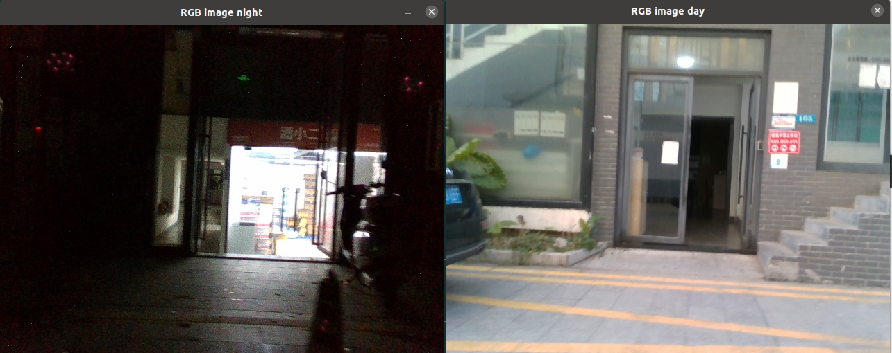
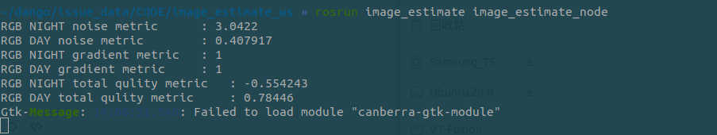

# 图像质量评估

- 参考文献

  Camera Exposure Control for Robust Robot Vision with Noise-Aware Image Quality Assessment

- 原始代码工程

  https://github.com/UkcheolShin/Noise-AwareCameraExposureControl

本项目把原工程中的 c++ 部分单独拿了出来，并进行测试

**测试效果：**

